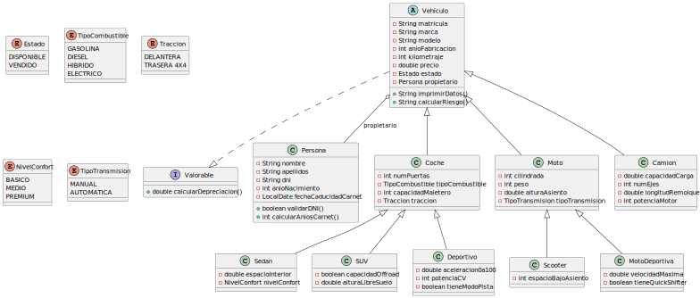

CHECKLIST

- Iniciar Repositorio - Hecho
- Estructurar archivos del proyecto - Hecho
- Crear Enums - Hecho
- Añadir Valorable - Hecho
- Crear Persona - Hecho
- Crear Vehiculo - Hecho
- Relacion VehiculoPersona - Hecho
- Crear Coche - Hecho
- Crear subtipos de coche - Hecho
- Crear moto y subtipos - Hecho
- Crear Camion - Hecho
- Herencias y relaciones UML - Comprobado
- Generar .svg - Hecho
- Ponerlo en el README - Hecho

